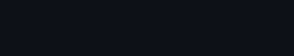

<!-- Saludo animado -->

  

<!-- Presentación -->
<h1 align="center">¡Hola, soy Matías!</h1>
<h3 align="center">Estudiante de segundo año en Dual: Desarrollo de Aplicaciones Multiplataforma (DAM) y Desarrollo de Aplicaciones Web (DAW)</h3>

<!-- Imágenes divertidas que representan lo que hacen vs. lo que se piensa -->

  
  

<!-- Estadísticas de GitHub -->

  

<!-- Redes sociales -->
<h3 align="center">Conecta conmigo</h3>

  
  

<!-- Estado del repositorio o sección en construcción -->

  

